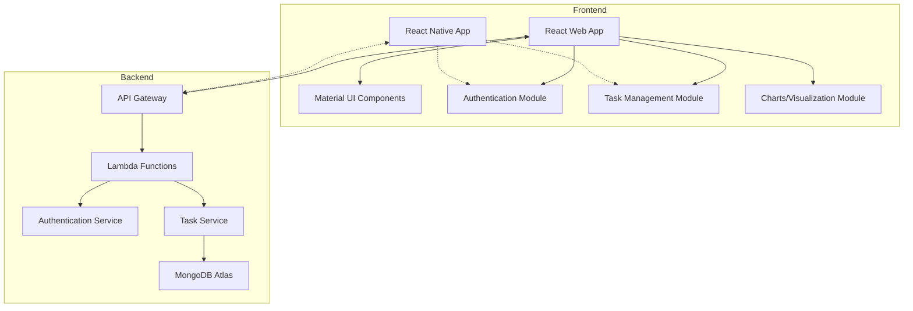
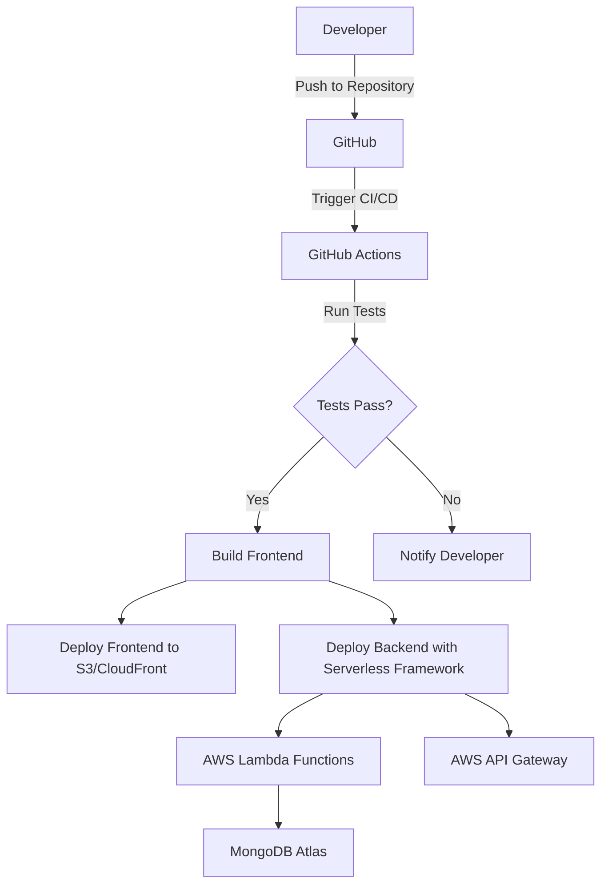

# Task Management System Implementation Plan

## 1. Architecture Overview



## 2. Technology Stack

### Frontend
- **React.js** for web application
- **Material UI** for responsive UI components
- **React Router** for navigation
- **Axios** for API communication
- **Chart.js** or **Recharts** for visualization
- **Jest** and **React Testing Library** for unit testing
- **React Native** (optional) for mobile app

### Backend
- **Python 3.9+** for Lambda functions
- **AWS Lambda** for serverless compute
- **AWS API Gateway** for REST API endpoints
- **MongoDB Atlas** for NoSQL database
- **PyJWT** for JWT token authentication
- **Pytest** for unit testing
- **Serverless Framework** for deployment
- **Docker** for containerization

## 3. Project Structure (Monorepo)

```
task-management-system/
├── frontend/                  # React web application
│   ├── public/
│   ├── src/
│   │   ├── components/        # Reusable UI components
│   │   ├── pages/             # Page components
│   │   ├── services/          # API services
│   │   ├── context/           # React context for state management
│   │   ├── utils/             # Utility functions
│   │   └── tests/             # Unit tests
│   ├── package.json
│   └── README.md
│
├── mobile/                    # React Native application (optional)
│   ├── src/
│   │   ├── components/        # Mobile UI components
│   │   ├── screens/           # Screen components
│   │   ├── services/          # API services (shared with web)
│   │   └── utils/             # Utility functions
│   ├── package.json
│   └── README.md
│
├── backend/                   # Python serverless backend
│   ├── src/
│   │   ├── auth/              # Authentication service
│   │   ├── tasks/             # Task management service
│   │   ├── models/            # Data models
│   │   ├── utils/             # Utility functions
│   │   └── tests/             # Unit tests
│   ├── serverless.yml         # Serverless Framework configuration
│   ├── requirements.txt
│   ├── Dockerfile
│   └── README.md
│
├── docs/                      # API documentation
│   ├── api-spec.yaml          # OpenAPI specification
│   └── README.md
│
├── docker-compose.yml         # Docker Compose for local development
└── README.md                  # Project overview and setup instructions
```

## 4. Implementation Plan

### Phase 1: Project Setup (1-2 days)

1. **Initialize project structure**
   - Create directory structure
   - Set up Git repository
   - Configure linting and formatting tools

2. **Set up frontend project**
   - Initialize React application with Create React App
   - Install required dependencies (Material UI, React Router, Axios, etc.)
   - Configure testing environment (Jest, React Testing Library)

3. **Set up backend project**
   - Initialize Python project
   - Set up virtual environment
   - Install required dependencies
   - Configure Serverless Framework
   - Set up Docker for local development

### Phase 2: Backend Implementation (3-4 days)

1. **Database setup**
   - Create MongoDB Atlas cluster
   - Define database schema for tasks
   - Create connection utilities

2. **Authentication service**
   - Implement user registration and login endpoints
   - Implement JWT token generation and validation
   - Create middleware for protected routes

3. **Task management service**
   - Implement CRUD operations for tasks
   - Add validation for task data
   - Implement error handling with appropriate HTTP status codes

4. **Unit testing**
   - Write tests for authentication service
   - Write tests for task management service
   - Set up CI/CD pipeline for automated testing

### Phase 3: Frontend Implementation (3-4 days)

1. **Authentication UI**
   - Create login and registration forms
   - Implement JWT token storage and management
   - Add protected routes

2. **Task management UI**
   - Create task list view with filtering options
   - Implement task creation form
   - Add task update and delete functionality
   - Implement responsive design with Material UI

3. **Visualization**
   - Create dashboard with task statistics
   - Implement charts for task status visualization

4. **Unit testing**
   - Write tests for authentication components
   - Write tests for task management components
   - Write tests for visualization components

### Phase 4: Integration and Deployment (2-3 days)

1. **API integration**
   - Connect frontend to backend API
   - Test end-to-end functionality
   - Fix any integration issues

2. **Deployment setup**
   - Configure Serverless Framework for AWS deployment
   - Set up frontend deployment (AWS S3 + CloudFront)
   - Configure CI/CD pipeline for automated deployment

3. **Documentation**
   - Create API documentation using OpenAPI
   - Write setup and usage instructions
   - Document deployment process

### Phase 5: Optional Mobile App (2-3 days)

1. **Mobile app setup**
   - Initialize React Native project
   - Configure shared code with web frontend
   - Set up navigation

2. **Mobile UI implementation**
   - Create mobile-optimized UI components
   - Implement authentication screens
   - Implement task management screens

## 5. API Design

### Authentication Endpoints

```
POST /auth/register
- Request: { "username": "string", "password": "string", "email": "string" }
- Response: { "message": "string", "user_id": "string" }

POST /auth/login
- Request: { "username": "string", "password": "string" }
- Response: { "token": "string", "user_id": "string" }
```

### Task Management Endpoints

```
GET /tasks
- Headers: { "Authorization": "Bearer {token}" }
- Response: [{ "id": "string", "title": "string", "description": "string", "status": "string", "created_at": "string", "updated_at": "string" }]

POST /tasks
- Headers: { "Authorization": "Bearer {token}" }
- Request: { "title": "string", "description": "string", "status": "string" }
- Response: { "id": "string", "title": "string", "description": "string", "status": "string", "created_at": "string", "updated_at": "string" }

PUT /tasks/{id}
- Headers: { "Authorization": "Bearer {token}" }
- Request: { "title": "string", "description": "string", "status": "string" }
- Response: { "id": "string", "title": "string", "description": "string", "status": "string", "created_at": "string", "updated_at": "string" }

DELETE /tasks/{id}
- Headers: { "Authorization": "Bearer {token}" }
- Response: { "message": "string" }
```

## 6. Database Schema

### Users Collection

```json
{
  "_id": "ObjectId",
  "username": "string",
  "email": "string",
  "password_hash": "string",
  "created_at": "date",
  "updated_at": "date"
}
```

### Tasks Collection

```json
{
  "_id": "ObjectId",
  "user_id": "string",
  "title": "string",
  "description": "string",
  "status": "string", // "todo", "in_progress", "completed"
  "created_at": "date",
  "updated_at": "date"
}
```

## 7. Deployment Strategy



## 8. Security Considerations

1. **Authentication**
   - Use JWT tokens with appropriate expiration
   - Store passwords securely with bcrypt hashing
   - Implement HTTPS for all communications

2. **Authorization**
   - Ensure users can only access their own tasks
   - Validate user permissions for all operations

3. **Data Validation**
   - Validate all input data on the server side
   - Sanitize user inputs to prevent injection attacks

4. **Error Handling**
   - Use appropriate HTTP status codes
   - Provide meaningful error messages without exposing sensitive information

## 9. Testing Strategy

1. **Unit Testing**
   - Test individual components and functions
   - Use mocking for external dependencies

2. **Integration Testing**
   - Test API endpoints with real data
   - Test frontend-backend integration

3. **End-to-End Testing**
   - Test complete user flows
   - Verify deployment configuration

## 10. Monitoring and Logging

1. **AWS CloudWatch**
   - Monitor Lambda function performance
   - Set up alerts for errors and performance issues

2. **Application Logging**
   - Implement structured logging
   - Track user actions and system events